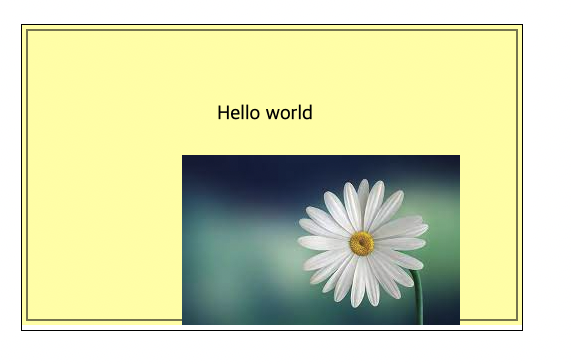

Ch1

canvas 객체의 getContext() 메서드로 구하는 2D 컨텍스트는 바로 모든 그리기 동작이 일어나는 장소를 말한다.
CanvasRenderingContext2D는 캔버스 좌 상단 모서리를 0, 0으로 표시

캔버스는 즉시 모드의 그림판으로 매번 변경이 있을 때마다 다시 그린다.

## 즉시모드의 장점

전격 속성을 사용하므로 변경 사항을 화면 전체에 적용하기 쉽다.
변경이 있을 때마다 화면을 아예 다시 그린다.

보류모드는 그리기 관련 객체를 저장해 놓고 출력 리스트로 작업한다. 플래시와 실버라이트가 보류 모드로 동작한다.

# 공개메서드

- getContext(): 캔버스에 그릴 때 사용하는 캔버스 2D컨텍스트의 참조김을 구한다.
- toDataURL(): 지금 그리는 Canvas 객체의 비트맵 이미지의 스트링 정보를 넘긴다. 화면의 스냅샷과 비슷, 다양한 MIME 타입을 매개변수로 넘김
