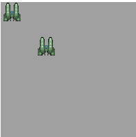

# draw image



## 이미지 크기 변환

```
drawImage(Image, dx, dy, dw, dh)
```

dw, dh: 캔버스 상에 그릴 사각형 부분의 높이와 폭을 나타낸다(scale을 나타낸다)

32 x 32크기의 이미지 객체를 사용한다면 아래 두 함수 결과는 같다
이미지 객체의 왼쪽 상단(0,0)을 기준으로 변환한다

```
context.drawImage(Image, 0, 0)
context.drawImage(Image, 0, 34, 32, 32)
```
